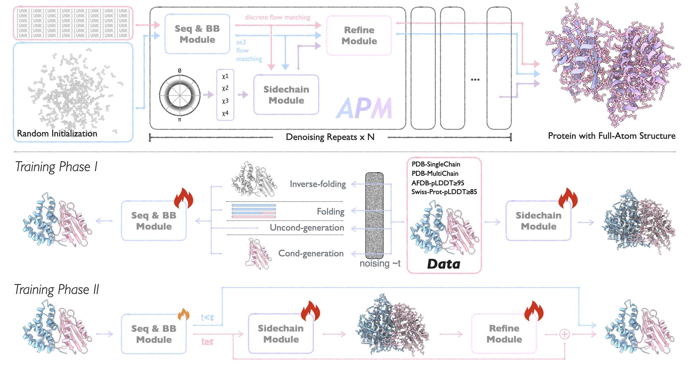

<div align="center">

# Official Implementation of APM (ICML'25) - An All-Atom Generative Model for Designing Protein Complexes

<a href="https://pytorch.org/get-started/locally/"></a>
<a href="https://pytorchlightning.ai/"></a>
<a href="https://hydra.cc/"></a>
<br>
</div>

This repository is the official implementation of the ICML'25 paper [An All-Atom Generative Model for Designing Protein Complexes](https://arxiv.org/abs/2504.13075), which introduces APM, a flow-based generative model for protein complex generation and design. 
APM precisely models inter-chain interactions by integrating all-atom information. It can design binding complexes from scratch, perform multi-chain folding/inverse-folding, and excels in conditional generation downstream tasks.

This code heavily relies on and builds off of the [Multiflow](https://github.com/jasonkyuyim/multiflow) code. We thank the authors of that work for their efforts.

If you have any issue about this work, please feel free to contact us by email:

- Ruizhe Chen: irobbenchen@gmail.com
- Dongyu Xue: xuedy_piupiupiu@outlook.com
- Zaixiang Zheng: zhengzaixiang@bytedance.com

<div align="center">
    
</div>

## Installation

```bash
# Install environment with dependencies
conda env create -f apm.yml

# Activate environment
conda activate apm

# Install local package
pip install -e .

# Install Flash Attention and FAESM manually
pip install flash-attn --no-build-isolation
pip install faesm[flash_attn]

# Install torch-scatter manually
pip install torch-scatter -f https://data.pyg.org/whl/torch-2.5.0+cu124/torch_scatter-2.1.2+pt25cu124-cp310-cp310-linux_x86_64.whl
```
We used a drop-in replacement for the ESM protein language model implementation named [FAESM](https://github.com/pengzhangzhi/faplm). 
We thank the authors for providing an efficient FlashAttention-based implementation, which significantly accelerated the training speed.

We've made some modifications to FAESM. Please replace the following files:
- Replace `/path/to/envs/site-packages/faesm/esm.py` with `assets/esm.py`

Please also replace `from torch._six import inf` with `from torch import inf`.

- `/path/to/envs/site-packages/deepspeed/runtime/utils.py`
- `/path/to/envs/site-packages/deepspeed/runtime/zero/stage_1_and_2.py`

You can use the folling command:

```bash
# For FAESM modifications
cp assets/esm.py /path/to/envs/site-packages/faesm/esm.py

# For deepspeed
sed -i 's/from torch\._six import inf/from torch import inf/' /path/to/envs/site-packages/deepspeed/runtime/utils.py
sed -i 's/from torch\._six import inf/from torch import inf/' /path/to/envs/site-packages/deepspeed/runtime/zero/stage_1_and_2.py
```

## Data

All datasets and model weights are hosted on Zenodo [here](https://zenodo.org/records/15480164). Download the following files:

- `APM_full_data_90.tar.gz` (9.5G)
- `cluster_0.tar.gz` (457.2 kB)
- `metadata.tar.gz` (130.0 MB)
- `swissprot_data.tar.gz` (11.2 GB)
- `pdb_test_full.tar.gz` (121.4 MB)
- `multimer_unclustered.tar.gz` (258.0 MB)
- `PepBench.tar.gz` (3.7 MB)
- `model_weights.tar.gz` (860.5 MB)

**Note:** If you only want to run evaluation, you only need to download the last four files.

Extract all downloaded files using:
```bash
tar -xzf *.tar.gz
```

The extracted `model_weights` directory should look like:

```
model_weights/
├── backbone/backbone_model.ckpt
├── sidechain/sidechain_model.ckpt
├── refine/
    ├── refine_model.ckpt
    └── config.yaml
```

These files provide weights for each module. You can use the Backbone Module weights to pretrain the Sidechain Module, or jointly pretrain all three modules using both the Backbone and Sidechain Module weights.

The extracted directory structure of `APM_full_data_90` should look like:

```
data_APM/
├── afdb/
│   └── <protein_id>.pkl
├── pdb_monomer/
│   └── <protein_id>.pkl
├── pdb_multimer/
│   └── <protein_id>.pkl
```

The `APM_full_data_90` directory includes three types of data: PDB monomers, PDB multimers, and preprocessed AFDB structures.

You can download and extract the data files to any location. We use relative paths in this project, so we recommend creating symbolic links from all data and weight paths to your current project directory. For example:

```bash
# If you've extracted APM_full_data_90.tar.gz to /path/to/data_APM
ln -s /path/to/data_APM ./data_APM
```

## Training

### Phase 1

#### Train Backbone Module

```bash
python apm/experiments/train_se3_flows.py -cn pretrain_backbone \
        experiment.design_level="backbone" \
        experiment.training.model_training_steps="backbone_1" \
        folding.PLM="faESM2-650M" \
        experiment.checkpointer.dirpath="/path/to/ckpt"
```

Key parameters:

- `model_training_steps`: Format is backbone_x-sidechain_x-refine_x, representing the number of training steps for each module in one round. Since we're only pretraining the Backbone Module here, we only need backbone_1.
- `design_level`: Only the Backbone Module is needed at this stage.
- `PLM`: Uses faESM2-650M as the language model to provide sequence representations.

#### Train Sidechain Module

```bash
python apm/experiments/train_se3_flows.py -cn pretrain_sidechain \
        experiment.design_level="sidechain" \
        experiment.training.model_training_steps="sidechain_1" \
        folding.PLM="faESM2-650M" \
        experiment.raw_state_dict_reload="/path/to/backbone_model.ckpt" \
        experiment.checkpointer.dirpath="/path/to/ckpt"
```

Key parameters:

- `model_training_steps`: Only pretraining the Sidechain Module, so we only need sidechain_1.
- `raw_state_dict_reload`: Requires the pretrained weights of the Backbone Module.

### Phase 2

#### Train All Modules

```bash
python apm/experiments/train_se3_flows.py -cn pretrain_refine \
        experiment.design_level="refine" \
        experiment.training.model_training_steps="backbone_2-sidechain_2-refine_8" \
        folding.PLM="faESM2-650M" \
        experiment.raw_state_dict_reload="/path/to/backbone_model.ckpt|/path/to/sidechain_model.ckpt" \
        experiment.checkpointer.dirpath="/path/to/ckpt"
```

Key parameters:

- `model_training_steps`: Jointly training all three modules.
- `raw_state_dict_reload`: Requires pretrained weights for both the Backbone and Sidechain Modules, separated by a pipe (|) character.

## Inference

### Main Tasks

Run the following command to execute six tasks: unconditional, unconditional_multimer, inverse_folding, inverse_folding_multimer, forward_folding, and forward_folding_multimer:

```bash
# Unconditional
python apm/experiments/inference_se3_flows.py -cn inference_unconditional \
        inference.predict_dir="/path/to/prediction" \
        inference.folding.pt_hub_dir="/path/to/ESMFold" \
        inference.ckpt_path="/path/to/refine_model.ckpt"

# Unconditional Multimer
python apm/experiments/inference_se3_flows.py -cn inference_unconditional_multimer \
        inference.predict_dir="/path/to/prediction" \
        inference.folding.pt_hub_dir="/path/to/ESMFold" \
        inference.ckpt_path="/path/to/refine_model.ckpt"

# Inverse Folding
python apm/experiments/inference_se3_flows.py -cn inference_inverse_folding \
        inference.predict_dir="/path/to/prediction" \
        inference.folding.pt_hub_dir="/path/to/ESMFold" \
        inference.ckpt_path="/path/to/refine_model.ckpt"

# Inverse Folding Multimer
python apm/experiments/inference_se3_flows.py -cn inference_inverse_folding_multimer \
        inference.predict_dir="/path/to/prediction" \
        inference.folding.pt_hub_dir="/path/to/ESMFold" \
        inference.ckpt_path="/path/to/refine_model.ckpt"

# Forward Folding
python apm/experiments/inference_se3_flows.py -cn inference_forward_folding \
        inference.predict_dir="/path/to/prediction" \
        inference.folding.pt_hub_dir="/path/to/ESMFold" \
        inference.ckpt_path="/path/to/refine_model.ckpt"

# Forward Folding Multimer
python apm/experiments/inference_se3_flows.py -cn inference_forward_folding_multimer \
        inference.predict_dir="/path/to/prediction" \
        inference.folding.pt_hub_dir="/path/to/ESMFold" \
        inference.ckpt_path="/path/to/refine_model.ckpt"
```

Results will be saved as CSV files in each task's subdirectory.

### Peptide Design

We provide preprocessed PepBench dataset files. After extracting `PepBench.tar.gz`, you'll get 93 PDB files, where chain A is the peptide to be designed and chain B is the given receptor. The `chain_design` parameter specifies which chain should be redesigned. If you don't specify the `sample_length` parameter, it will automatically set the design length to match the ground truth length. For each sample, the prediction command is:

```bash
python apm/experiments/inference_conditional.py -cn inference_conditional \
        conditional_dataset.pdb_path="PepBench/6qg8.pdb" \
        conditional_dataset.sample_num=8 \
        conditional_dataset.chain_design="A" \
        inference.predict_dir="/path/to/prediction" \
        inference.conditional_ckpt_path="/path/to/refine_model.ckpt"
```

In pretraining, we used ground truth for centering, but this creates a challenge during sampling for downstream tasks where this centering offset is unknown. To address this, we implemented a random centering based on the condition region, which is effective for short peptide design tasks.

For designing longer binders, we recommend exploring multiple centering points. Specifically, by setting `direction_condition` and `direction_surface` to null, the model will randomly select an amino acid on the surface and the center of the condition region, creating a weighted average for final centering:

```bash
python apm/experiments/inference_conditional.py -cn inference_conditional \
        conditional_dataset.pdb_path="/path/to/pdb" \
        conditional_dataset.sample_num=8 \
        conditional_dataset.chain_design="chain_to_design" \
        inference.predict_dir="/path/to/prediction" \
        inference.conditional_ckpt_path="/path/to/refine_model.ckpt" \
        conditional_dataset.direction_condition=null \
        conditional_dataset.direction_surface=null
```

Note that this random centering may lead to significant variations in results between runs. We recommend generating many samples and using Rosetta's dG for initial screening. Specifically, we used the dG calculation code provided in this [repository](https://github.com/THUNLP-MT/PepGLAD/blob/main/evaluation/dG/energy.py). In our experience, selecting samples with the lowest dG values serves as an effective initial screening method. This approach helps filter out two problematic types of samples: those with dG=0 (indicating the generated chain is too far from the target, resulting in no interaction) and those with dG>0 (indicating severe structural conflicts). However, we recommend carefully examining samples with extremely low dG values, as incorrect centering can sometimes produce unrealistic structures where the generated chain wrap uniformly around the condition chains, despite appearing favorable according to the energy function. We further suggest using confidence metrics like AlphaFold3's pLDDT for additional filtering.

## Licenses

APM source code and auxiliary files is licensed under [Apache License 2.0](https://www.apache.org/licenses/LICENSE-2.0). 
APM model weights and datasets are licensed under [CC BY 4.0](https://creativecommons.org/licenses/by/4.0/deed.en). 
The APM data files `APM_full_data_90.tar.gz` and `swissprot_data.tar.gz` are derived from [preprocessed PDB](https://zenodo.org/records/10714631) and [AlphaFold Database](https://alphafold.ebi.ac.uk/download), which are licensed uder CC BY 4.0; your use of that data must comply with their respective licenses.

## Citation

```
@inproceedings{chen2025apm,
  title={An All-Atom Generative Model for Designing Protein Complexes},
  author={Chen, Ruizhe and Xue, Dongyu and Zhou, Xiangxin and Zheng, Zaixiang and Zeng, Xiangxiang and Gu, Quanquan},
  booktitle={International Conference on Machine Learning},
  year={2025}
}
```